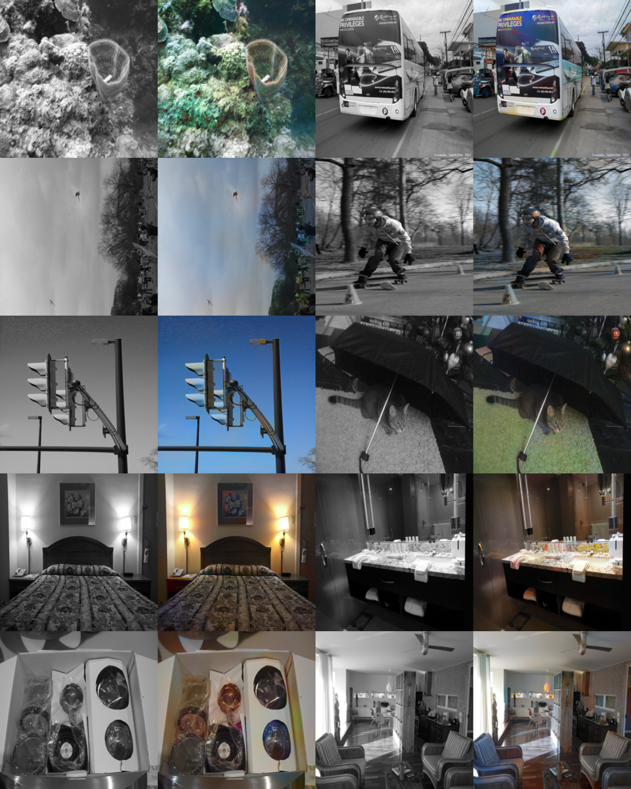

# PriorityHue

PriorityHue is a deep learning-based colorization tool that takes black-and-white images and returns colorized versions using a Generative Adversarial Network (GAN) model.



## Prerequisites

- Python 3.x
- PyTorch
- Additional dependencies (install via `requirements.txt`)

## Installation

1. Clone the repository:
   ```bash
     git clone https://github.com/sdimarzo/PriorityHue.git
   ```
2. Install requirments
   ``` bash
     pip install -r requirements.txt
   ```
## Usage

To run the program, use the following command:

```bash
python main.py --i path_to_bw_image [-o output_path] [-n image_name]
```
- -i: (Required) The path to the black-and-white image that needs to be colorized.
- -o: (Optional) Specify the output directory where the colorized image will be saved. If not provided, the current directory is used.
- -n: (Optional) Specify the name of the output image file. If not provided, a default name is assigned.
